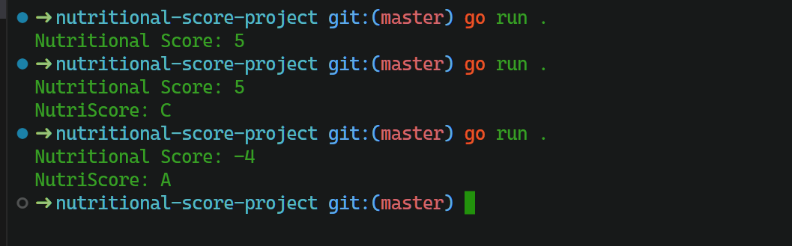

# get-nutritious-go

- Golang Library to check the nutritional score

### Clone the repository as:

`github.com/rudrakshkarpe/get-nutritious-go`

### Afterwards navigate to the directory and run as:

```go run .```

### Your output should look like this:



<details>
<summary> Check List✅: <summary>

  -  Develop custome feature for userinput
  -  Upload the Go libarary index
  -  Refactor code

</details>
